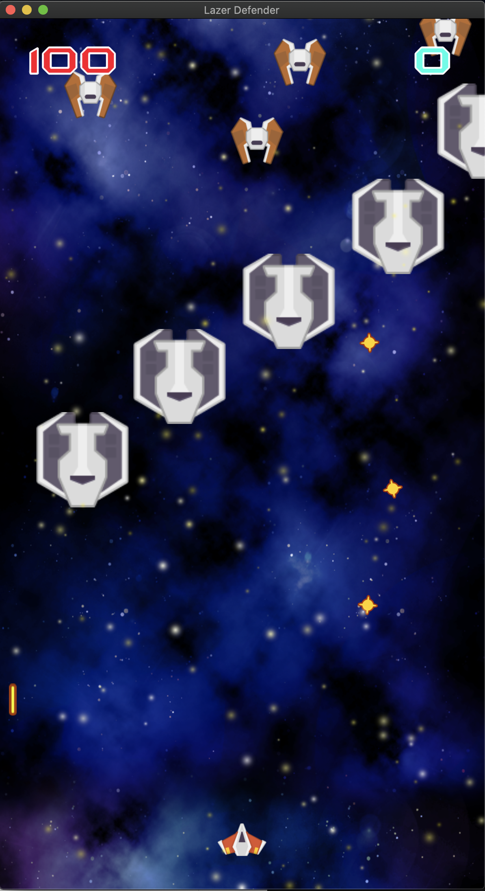

# Lazer-Defender-Unity-2D
- Lazer Defender is a Unity 2D developed retro like space shooter designed to either be played on a keyboard or using controller (PS4/Xbox One). Destroy all enemies and increase your score!

## Game Pages and Functionalities:

**Main Menu**

*This is the Starting screen of the game, where you can either start or quit the game.*

---

**Gameplay Screen**

*Here is where you battle enemy spaceships with your lasers!*  

---

**GameOver Screen**

*This is the Game Over screen, which comes from losing all your health when getting shot at by enemy space ships.*

--- 
